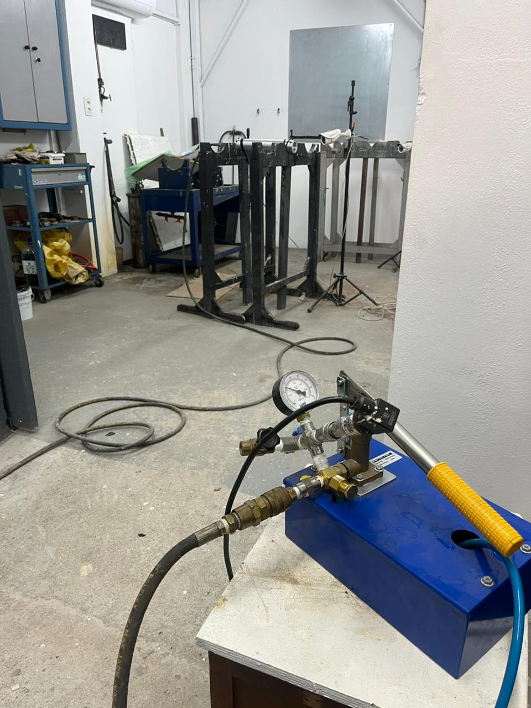
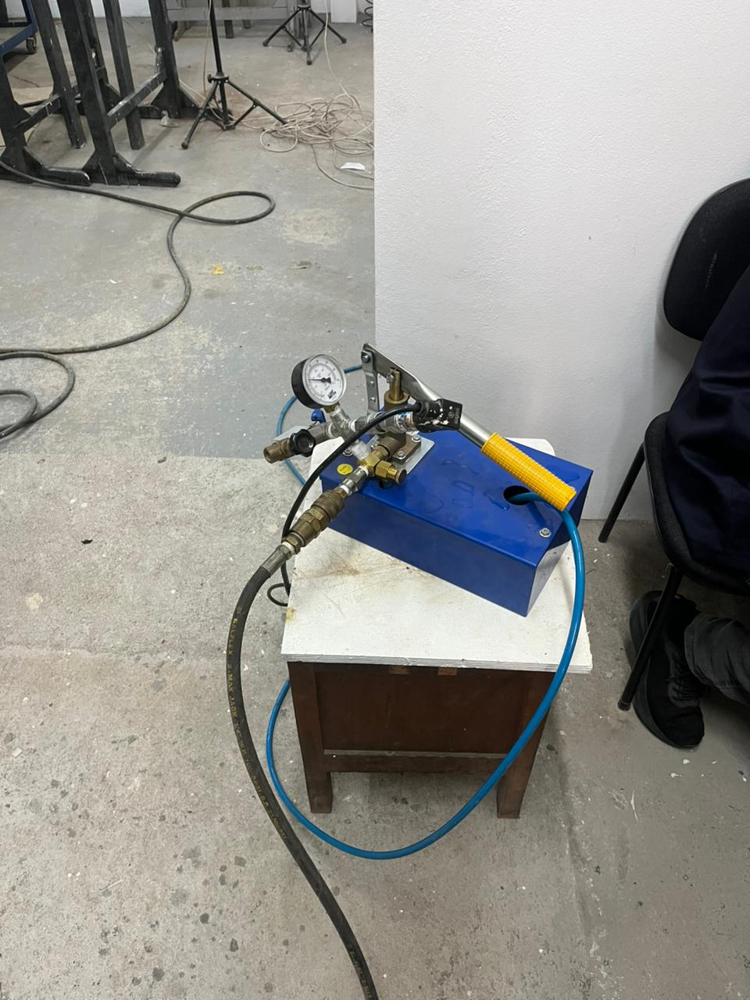
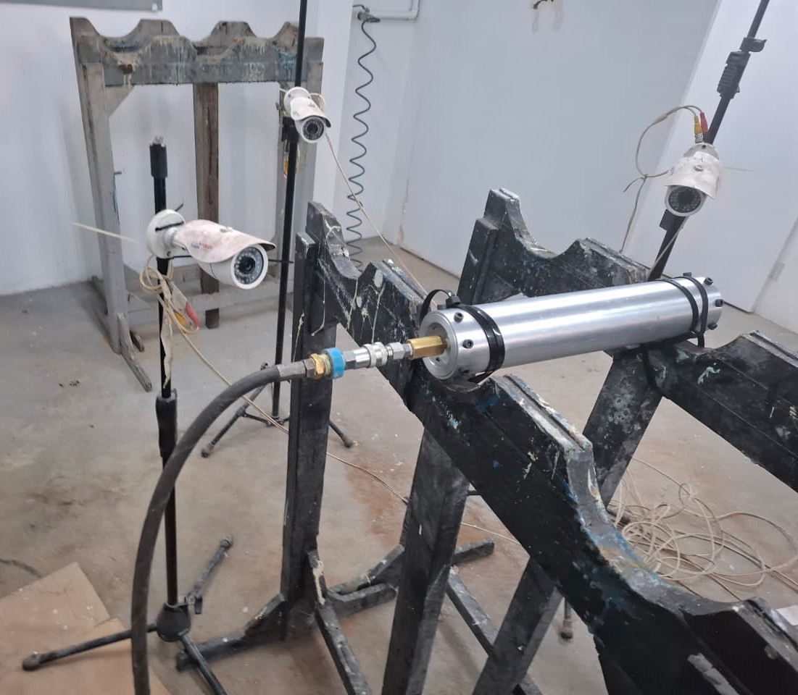
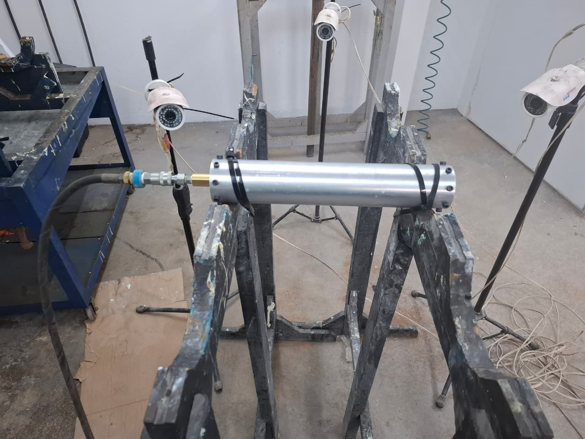
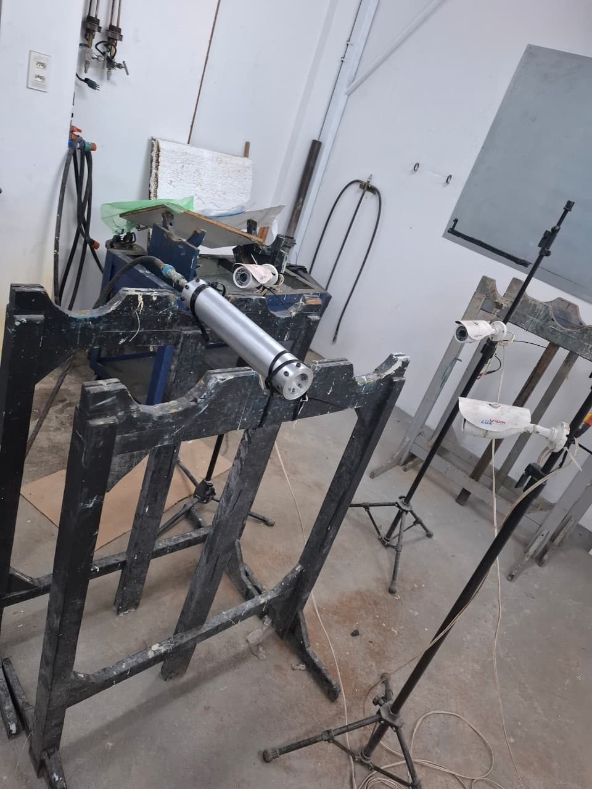
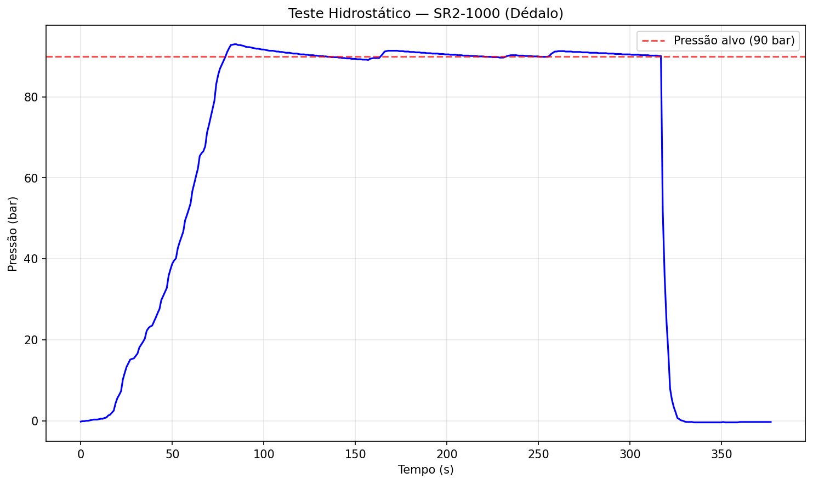

# Missão Dédalo — LASC 2026

## Informações Gerais

| Campo | Valor |
|---|---|
| **Missão** | Dédalo |
| **Competição** | 7th Latin American Space Challenge (LASC 2026) |
| **Foguete** | 1km |
| **Motor** | SR2-1000 |
| **Data do teste** | 26/06/2026 |
| **Local** | Laboratório de Adesão e Aderência |
| **Responsáveis** | Caio, Ítalo e Steffany |

## Motor SR2-1000

| Especificação | Valor |
|---|---|
| Empuxo | [aguardando issue #24] |
| Propulsante | [a definir] |
| Status | Aguardando CAD |

## Foguete 1km

| Especificação | Valor |
|---|---|
| Altitude alvo | 1000m |
| Material do tubo | [a definir] |
| Material da tampa | [a definir] |
| Material do nozzle | [a definir] |

## Teste Hidrostático

### Parâmetros

| Parâmetro | Valor |
|---|---|
| Pressão alvo | 90 bar |
| Pressão máxima atingida | 91 bar |
| Tempo de prova | 6 min |
| Fluido utilizado | Água |

### Resultados

| Critério | Resultado |
|---|---|
| **Resultado geral** | Aprovado |
| Vazamentos observados | Não |
| Deformações visíveis | Não |
| Observações de segurança | Nenhuma |

### Evidências

<table>
<tr>
<td align="center" width="300">
<br/>
<i>Bomba hidráulica manual com manômetro e mangueiras</i>
</td>
<td align="center" width="300">
<br/>
<i>Equipamento de pressurização em laboratório</i>
</td>
<td align="center" width="300">
<br/>
<i>Motor SR2-1000 posicionado na bancada de teste</i>
</td>
</tr>
<tr>
<td align="center" width="300">
<br/>
<i>Motor fixado com câmeras de monitoramento</i>
</td>
<td align="center" width="300">
<br/>
<i>Vista geral da montagem completa</i>
</td>
</tr>
</table>

### Gráfico

<br/>
<em>Pressão × Tempo — teste hidrostático SR2-1000: atingiu ~93 bar, manteve patamar acima de 90 bar por ~240s sem vazamento.</em>

### Dados

- [Dados exportados — pressão × tempo (.csv)](./tests/hydrostatic/teste_hidrostatico_dados.csv)

## Teste Estático

- [Dados dos testes estáticos — Empuxo × Tempo](./tests/static/)
- **1º teste:** pico ≈ 179.700, queima ≈ 165,5–168,2s
- **2º teste:** pico ≈ 218.000, queima ≈ 111,4–112,8s
- Detalhes no [README](./tests/static/README.md)

## Estrutura

```
lasc-2026-dedalo/
├── motor/              # SR2-1000 (aguardando CAD, issue #24)
│   ├── cad/
│   ├── drawings/
│   ├── images/
│   ├── openmotor/
│   ├── parasolid/
│   └── stl/
├── rocket/             # Foguete 1km
│   ├── assembly/
│   ├── cad/
│   ├── mold/
│   ├── openmotor/
│   ├── parasolid/
│   └── step/
├── tests/
│   ├── hydrostatic/    # Teste hidrostático (26/06/2026)
│   └── static/         # Testes estáticos 1 e 2 do motor
└── README.md
```

## Issues Relacionadas

- [Issue #7: Dados do teste hidrostático - Dédalo](https://github.com/Serra-Rocketry/motor/issues/7)
- [Issue #24: SR2-1000 - Documentar motor](https://github.com/Serra-Rocketry/motor/issues/24)

## Referências

- [7th Latin American Space Challenge (LASC 2026)](https://www.lasc.space)
