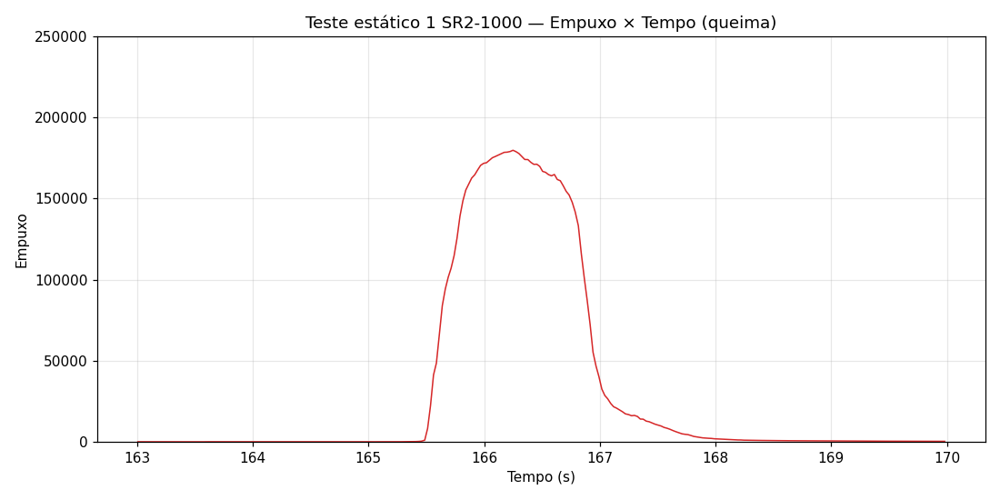

# Testes Estáticos — SR2-1000

Dados de testes estáticos do motor **SR2-1000** (missão [Dédalo — LASC 2026](../../README.md)).

## Teste Estático 1

| Campo | Valor |
|---|---|
| Motor | SR2-1000 (1000m) |
| Teste | 1º teste estático |
| Fonte dos dados | thrust-stand (SD card) |
| Formato | `Tempo (ms), Empuxo, Pressao` |
| Pressão registrada | 0 (não coletada) |

### Dados

- [Dados brutos — Empuxo × Tempo (.csv)](./teste_estatico_1_dados.csv)
- [Gráfico — Empuxo × Tempo](./empuxo_tempo_1.png)

### Gráfico

 
<em>Queima do SR2-1000 (1º teste): subida ~165,5s, pico ≈179.700 ~166,2s, cauda até ~168,2s. Escala limitada a 250.000 para visualizar a queima (spikes de sensor fora do gráfico).</em>

## Teste Estático 2

> Este foi o **2º teste estático** realizado do mesmo motor (SR2-1000).

| Campo | Valor |
|---|---|
| Motor | SR2-1000 (1000m) |
| Teste | 2º teste estático |
| Fonte dos dados | thrust-stand (SD card) |
| Formato | `Tempo (ms), Empuxo, Pressao` |
| Pressão registrada | 0 (não coletada) |

### Dados

- [Dados brutos — Empuxo × Tempo (.csv)](./teste_estatico_2_dados.csv)
- [Gráfico — Empuxo × Tempo](./empuxo_tempo_2.png)

### Gráfico

 
<em>Queima do SR2-1000 (2º teste): subida ~111,4s, pico ≈218.000 ~112,2s, retorno ao baseline ~112,8s. Escala limitada a 300.000 para visualizar a queima (spikes de sensor fora do gráfico).</em>

## Observações

- O tempo está em **milissegundos** no CSV; os gráficos convertem para segundos.
- Ambos os testes apresentam **spikes de sensor** (~970.000–983.000) em pontos fora da queima — artefatos da célula de carga/ADC, não empuxo real. Foram excluídos dos gráficos via limite de escala.
- A pressão não foi registrada nestes testes (coluna zerada).
