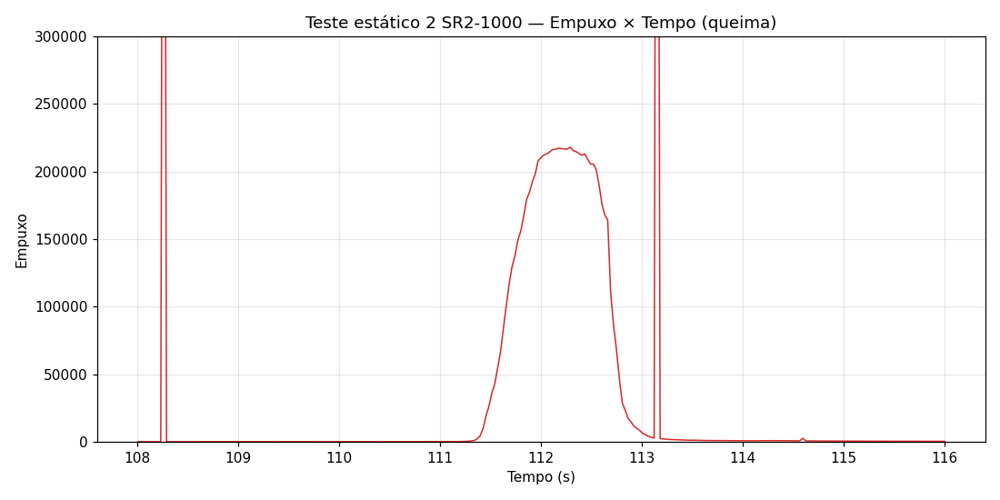

# Teste Estático 2 — SR2-1000

Dados de teste estático do motor **SR2-1000** (missão [Dédalo — LASC 2026](../../README.md)).

> Este foi o **2º teste estático** realizado do mesmo motor (SR2-1000).

## Informações do Teste

| Campo | Valor |
|---|---|
| Motor | SR2-1000 (1000m) |
| Teste | 2º teste estático |
| Fonte dos dados | thrust-stand (SD card) |
| Formato | `Tempo (ms), Empuxo, Pressao` |
| Pressão registrada | 0 (não coletada) |

## Dados

- [Dados brutos — Empuxo × Tempo (.csv)](./teste_estatico_2_dados.csv)
- [Gráfico — Empuxo × Tempo](./empuxo_tempo.png)

## Gráfico

 
<em>Queima do SR2-1000: subida ~111,4s, pico ≈218.000 ~112,2s, retorno ao baseline ~112,8s. Escala limitada a 300.000 para visualizar a queima (spikes de sensor fora do gráfico).</em>

## Observações

- O tempo está em **milissegundos** no CSV; o gráfico converte para segundos.
- Existem **spikes de sensor** (~970.000–983.000) em t≈108,4s e t≈113,15s — artefatos da célula de carga/ADC, não empuxo real. Foram excluídos do gráfico via limite de escala.
- A pressão não foi registrada neste teste (coluna zerada).
