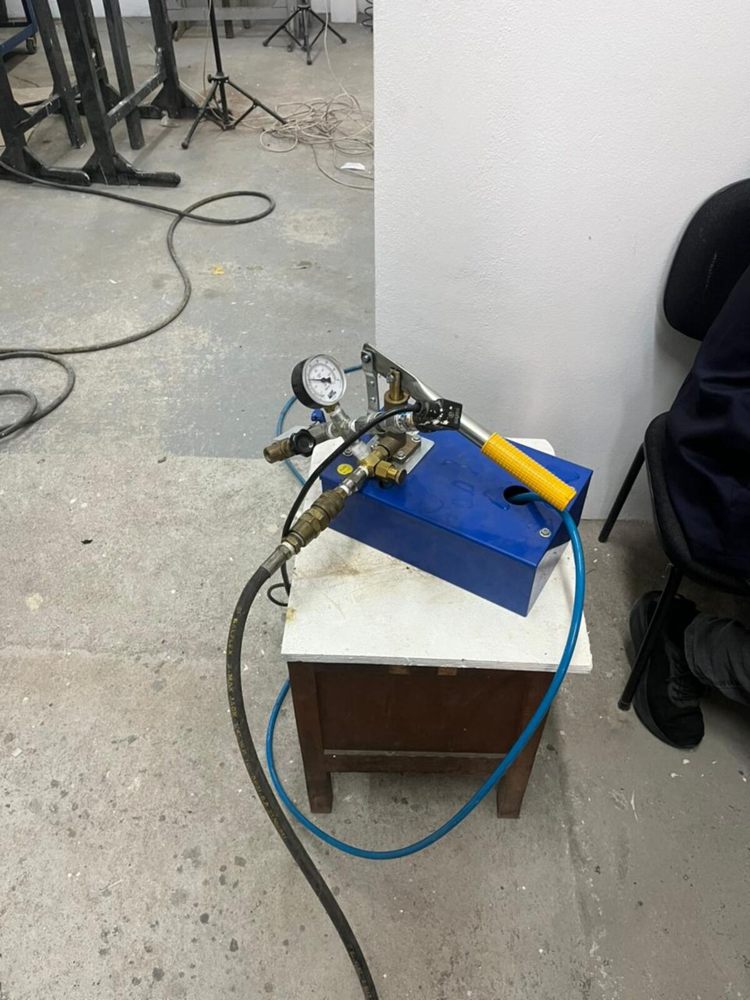
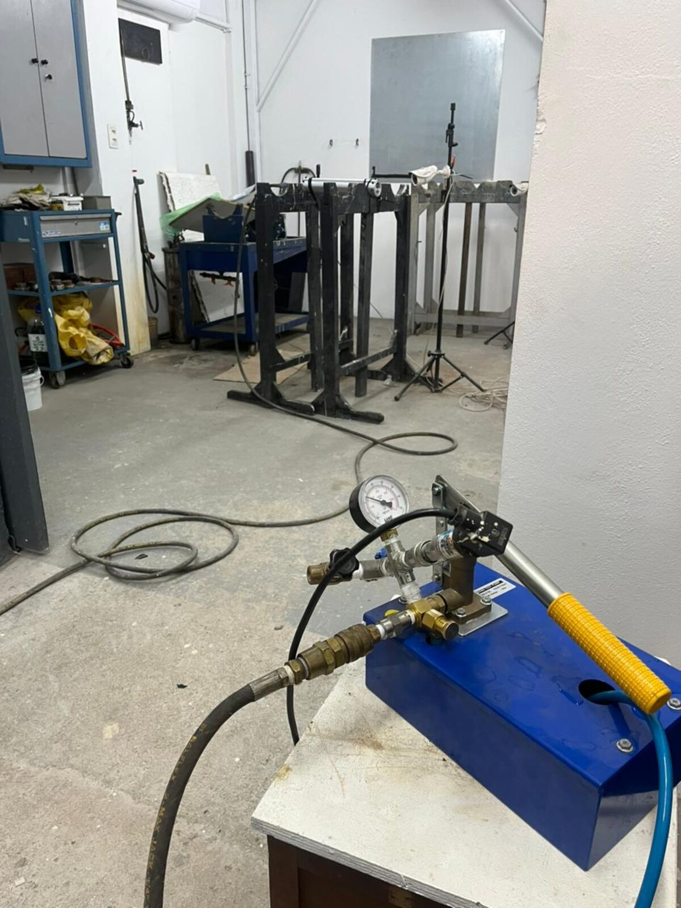
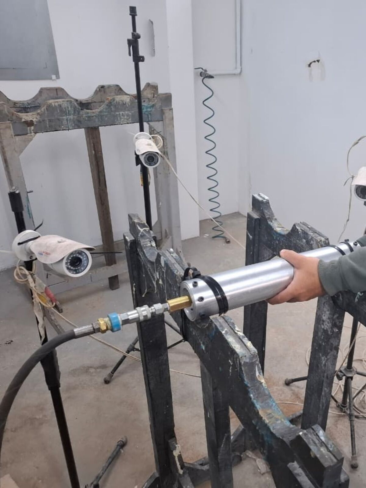
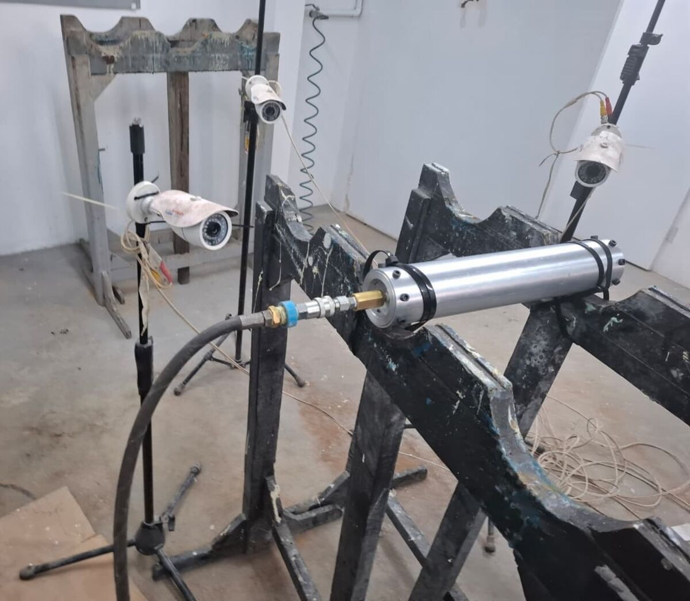
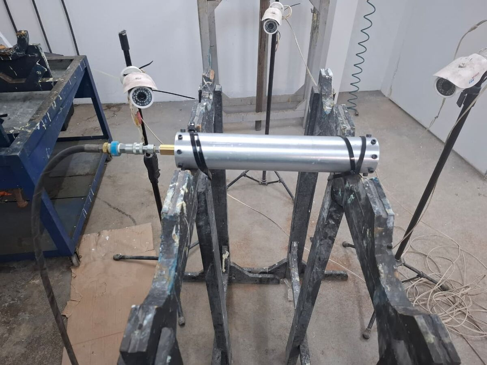
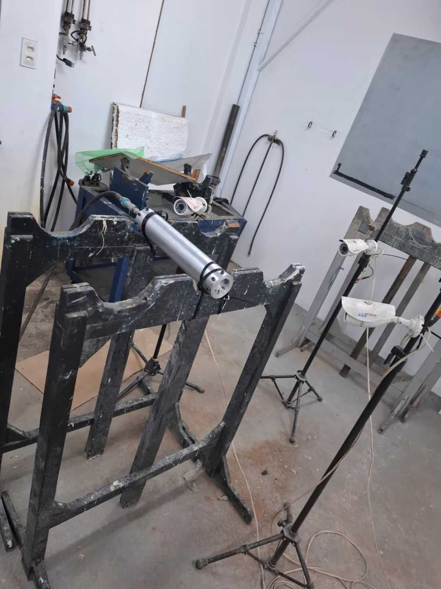

# Missão Thonyan — LASC 2026

## Informações Gerais

| Campo | Valor |
|---|---|
| **Missão** | Thonyan |
| **Competição** | 7th Latin American Space Challenge (LASC 2026) |
| **Foguete** | 500m |
| **Motor** | SR500M |
| **Data do teste** | 11/06/2026 |
| **Local** | Laboratório de Adesão e Aderência |
| **Responsáveis** | Caio, Joana e Steffany |

## Teste Hidrostático

### Parâmetros

| Parâmetro | Valor |
|---|---|
| Pressão alvo | 62 bar |
| Pressão máxima atingida | 64 bar |
| Tempo de prova | 10 min |
| Fluido utilizado | Água |

### Resultados

| Critério | Resultado |
|---|---|
| **Resultado geral** | Aprovado |
| Vazamentos observados | Não |
| Deformações visíveis | Não |
| Observações de segurança | Nenhuma |

### Evidências








### Dados

- [Planilha de dados (pressão x tempo)](./tests/hydrostatic/TESTE_HIDROSTATICO_500m_62bar.xls)

### Vídeo

- [Vídeo do teste (Google Drive)](https://drive.google.com/file/d/1uUkc7NuGaZSWjlcIh_S-NmDpeM9jrFmb/view?usp=sharing)

## Estrutura

```
lasc-2026-thonyan/
├── motor/              # SR500M (aguardando CAD, issue #23)
│   ├── cad/
│   ├── drawings/
│   ├── images/
│   ├── openmotor/
│   ├── parasolid/
│   └── stl/
├── rocket/             # Foguete 500m
│   ├── assembly/
│   ├── cad/
│   ├── openmotor/
│   ├── simulation/
│   └── documentation.md
├── tests/
│   └── hydrostatic/    # Teste hidrostático (11/06/2026)
└── README.md
```

## Issues Relacionadas

- [Issue #8: Dados do teste hidrostático - Thonyan](https://github.com/Serra-Rocketry/motor/issues/8)
- [Issue #23: SR500M - Documentar motor](https://github.com/Serra-Rocketry/motor/issues/23)
- [Issue #25: Simulações 500m - Verificar origem](https://github.com/Serra-Rocketry/motor/issues/25)
