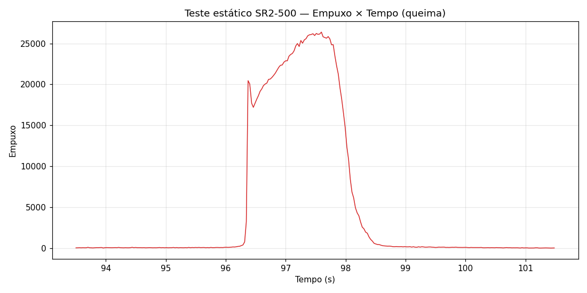

# Teste Estático — SR2-500

Dados de teste estático do motor **SR2-500** (missão [Thonyan — LASC 2026](../../README.md)).

## Informações do Teste

| Campo | Valor |
|---|---|
| Motor | SR2-500 (500m) |
| Teste | 1º teste estático |
| Fonte dos dados | thrust-stand (SD card) |
| Formato | `Tempo (ms), Empuxo, Pressao` |
| Pressão registrada | 0 (não coletada) |

## Dados

- [Dados brutos — Empuxo × Tempo (.csv)](./teste_estatico_dados.csv)
- [Gráfico — Empuxo × Tempo](./empuxo_tempo.png)

## Gráfico

 
<em>Queima do SR2-500: subida íngreme ~96,3s, pico ≈26.500 ~97,5s, retorno ao baseline ~99,0s. Spike de ignição no início da subida é transiente normal.</em>

## Observações

- O tempo está em **milissegundos** no CSV; o gráfico converte para segundos.
- Há um spike isolado de sensor (~980.000) em t≈17,76s, fora da janela de queima — ignorado no gráfico.
- A pressão não foi registrada neste teste (coluna zerada).
