# Molde do Grão Propelente — SR2-500

Molde utilizado na manufatura do grão propelente do motor **SR2-500** (missão [Thonyan — LASC 2026](../../missions/lasc-2026-thonyan/README.md)).

## Manufatura

O projeto foi desenvolvido no **Autodesk Fusion 360** e as peças impressas foram fabricadas por **manufatura aditiva (FDM)** em uma impressora **Ender 3 V1**, com filamento **PETG**.

### Justificativa do material

A escolha do PETG em detrimento de filamentos como o PLA deve-se à sua maior **temperatura de transição vítrea (Tg ≈ 80°C vs ≈ 60°C do PLA)**, característica essencial para aplicações onde o molde é submetido a temperaturas elevadas durante o processo de cura e/ou vazamento do propelente.

## Peças do molde

| Peça | Material | Função |
|---|---|---|
| Base | PETG branco | Flange quadrada com 4 furos de fixação; fecha a face inferior do molde |
| Meias-cascas (x2) | PETG vermelho | Corpo externo do molde; unidas por parafusos através das abas nas extremidades |
| Núcleo | Teflon (tarugo/tubo) | Define a perfuração central do grão; superfície lisa facilita a remoção após a cura |
| Liner | Papelão | Tubo de papelão inserido nas meias-cascas, barreira entre o propelente e o molde |

> **Núcleo:** o núcleo não é impresso — é um tarugo/tubo comercial de Teflon (PTFE), cuja baixa aderência permite retirar o grão curado sem danificar a geometria. Por isso não possui arquivo CAD/STEP.

## Imagens

### Molde montado

<table>
<tr>
<td align="center" width="300">
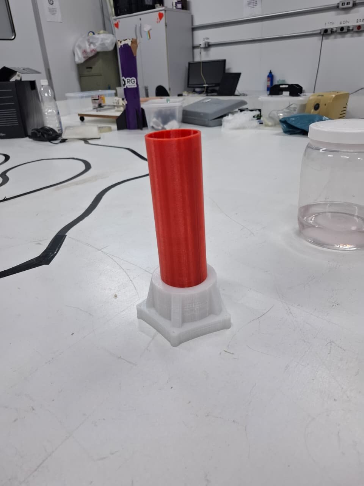 
<i>Vista geral do molde montado (base + corpo)</i>
</td>
<td align="center" width="300">
 
<i>Vista lateral do molde montado</i>
</td>
<td align="center" width="300">
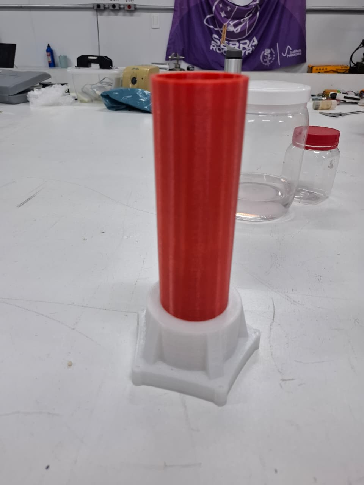 
<i>Molde montado visto de outro ângulo</i>
</td>
</tr>
<tr>
<td align="center" width="300">
 
<i>Vista frontal do molde montado</i>
</td>
<td align="center" width="300">
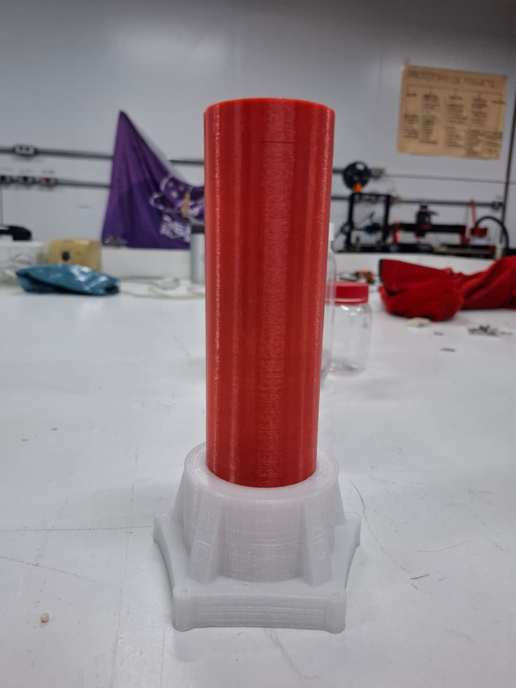 
<i>Detalhe do molde montado</i>
</td>
<td></td>
</tr>
</table>

### Base

<table>
<tr>
<td align="center" width="300">
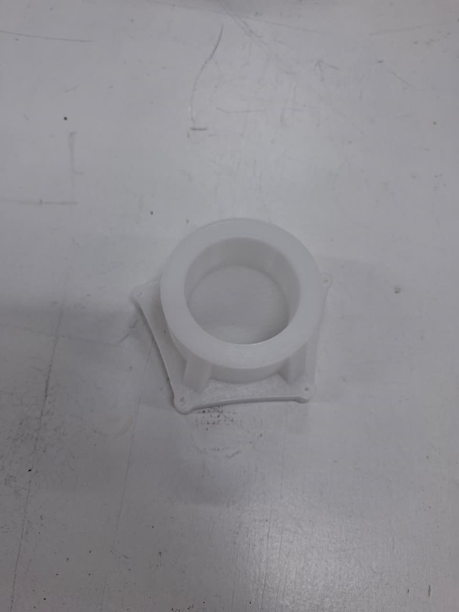 
<i>Base vista de cima em ângulo</i>
</td>
<td align="center" width="300">
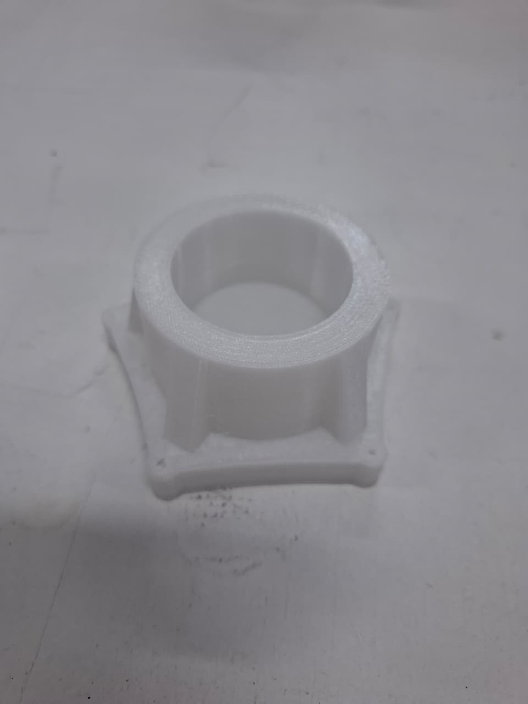 
<i>Base isolada, ângulo próximo</i>
</td>
<td align="center" width="300">
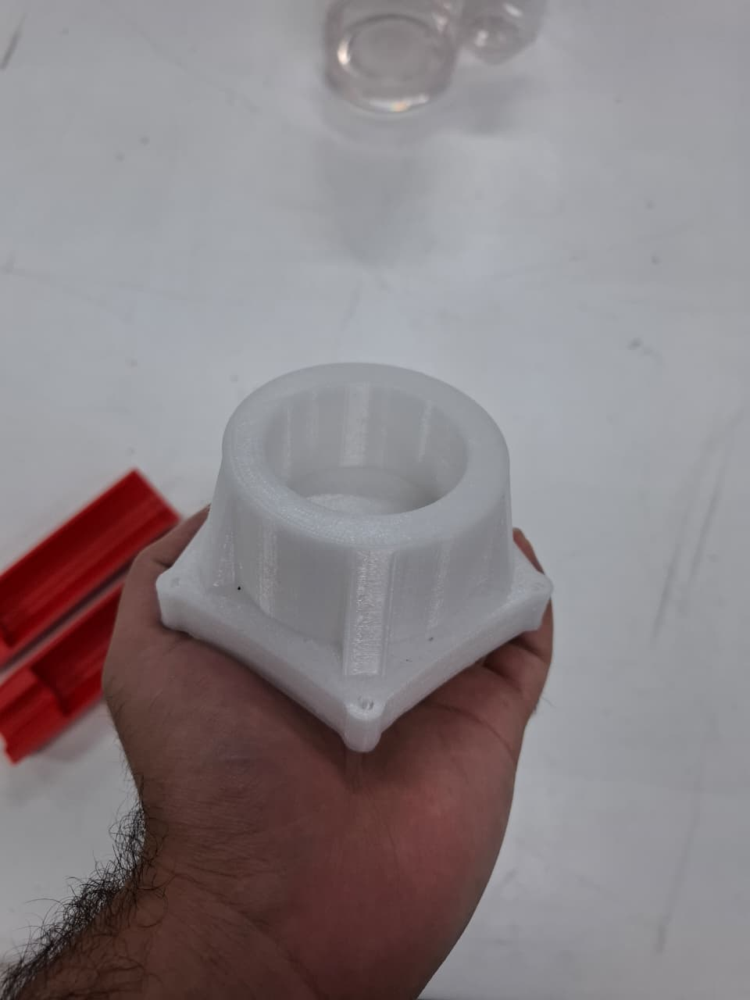 
<i>Base na mão (escala), vista frontal</i>
</td>
</tr>
<tr>
<td align="center" width="300">
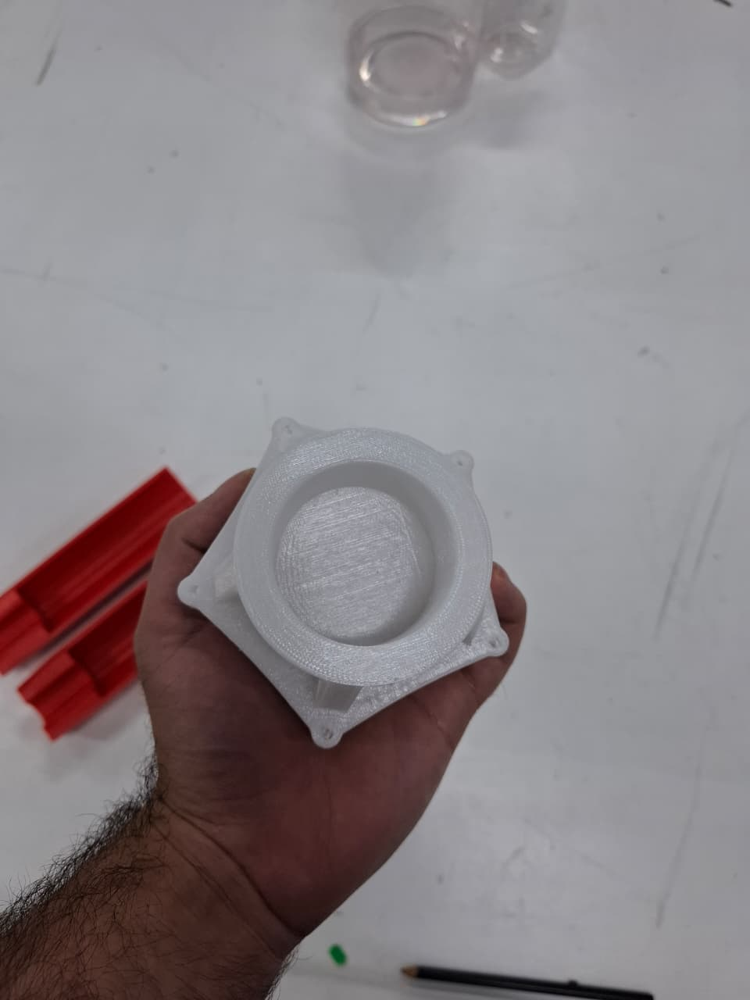 
<i>Base na mão, vista superior (cavidade central)</i>
</td>
<td></td>
<td></td>
</tr>
</table>

### Meias-cascas

<table>
<tr>
<td align="center" width="300">
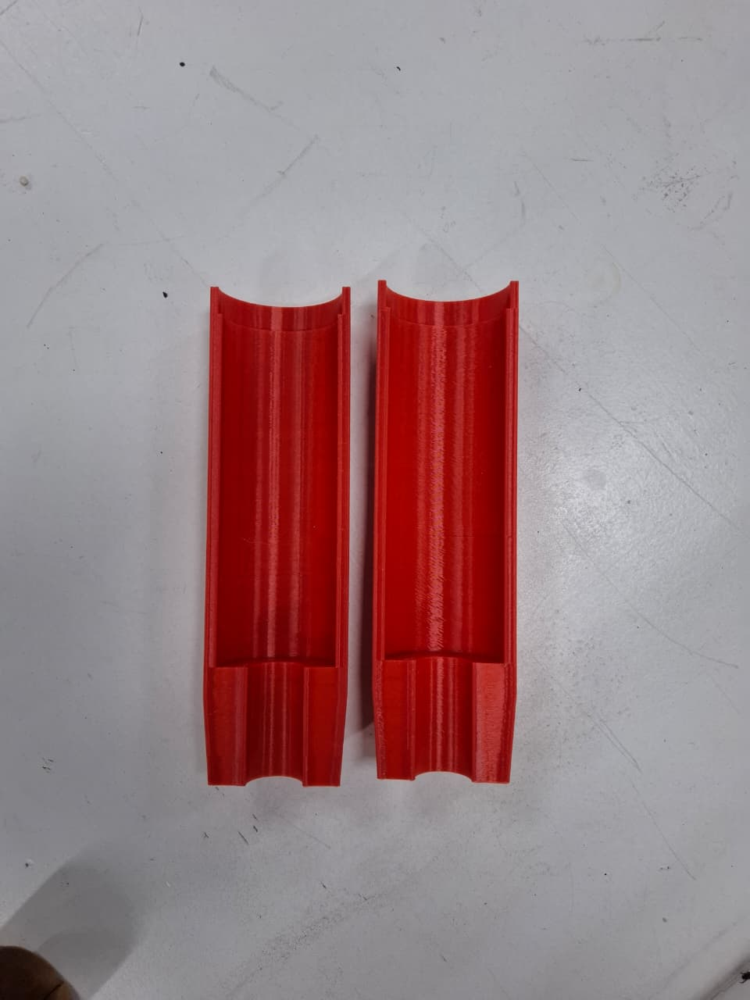 
<i>Par de meias-cascas lado a lado</i>
</td>
<td align="center" width="300">
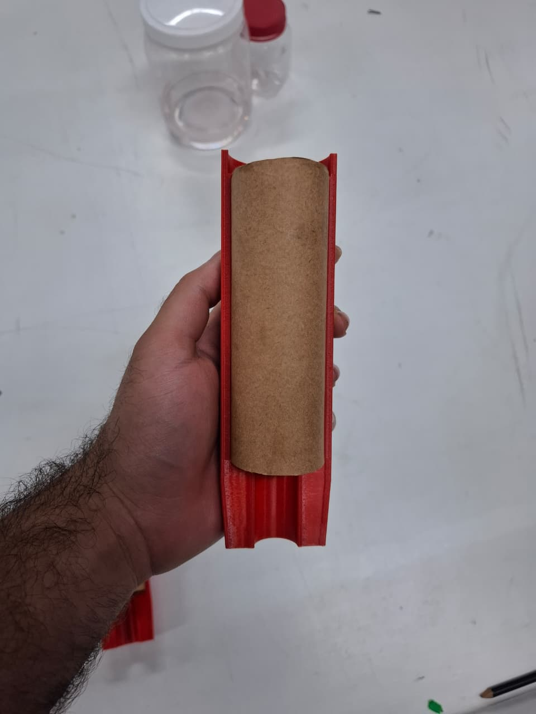 
<i>Meia-casca com tubo de papelão encaixado</i>
</td>
<td align="center" width="300">
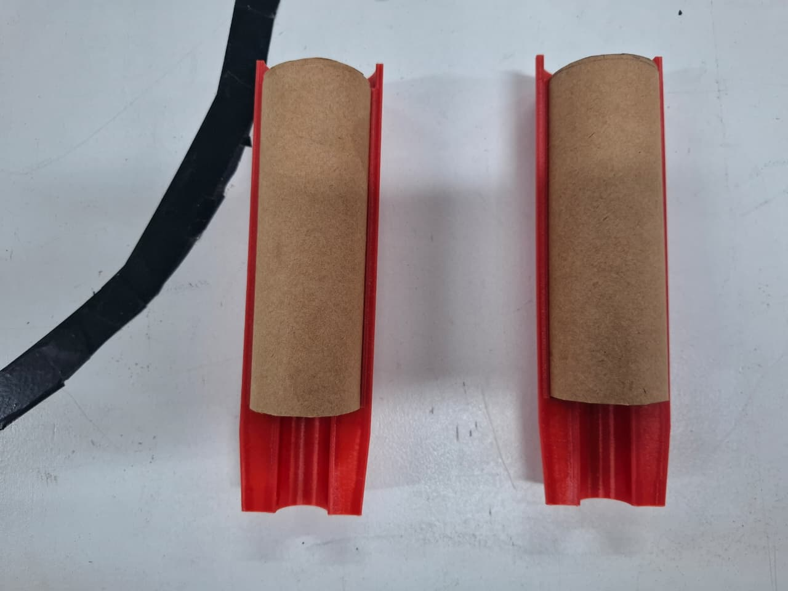 
<i>Meias-cascas com tubos de papelão, prontas para fechar</i>
</td>
</tr>
<tr>
<td align="center" width="300">
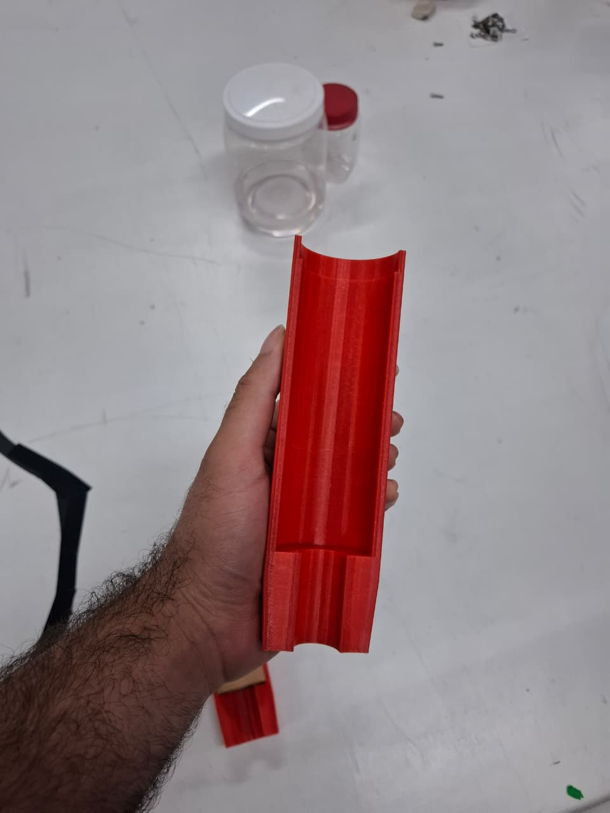 
<i>Meia-casca vazia (canal interno e abas de fixação)</i>
</td>
<td></td>
<td></td>
</tr>
</table>

## Arquivos

| Arquivo | Descrição |
|---|---|
| [`base.step`](./base.step) | Base do molde (flange + cavidade central) |
| [`lado1-500.step`](./lado1-500.step) | Meia-casca 1 |
| [`lado2-500.step`](./lado2-500.step) | Meia-casca 2 |
| [`images/`](./images/) | Fotos do molde impresso |
